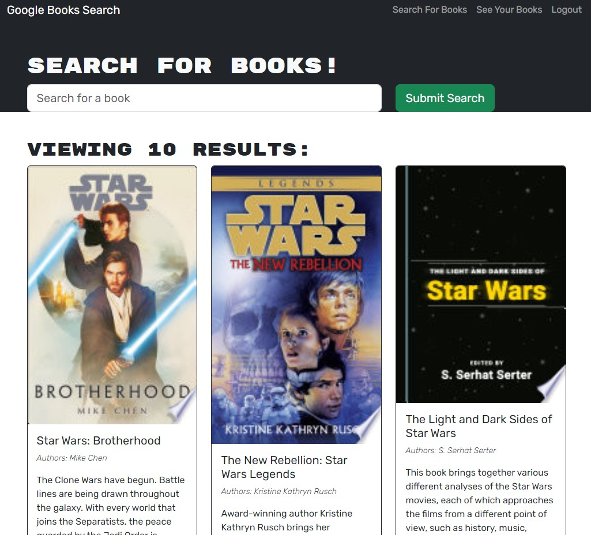
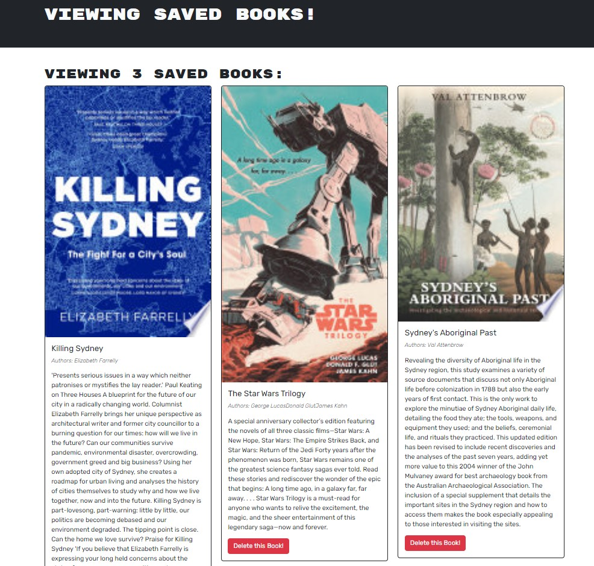
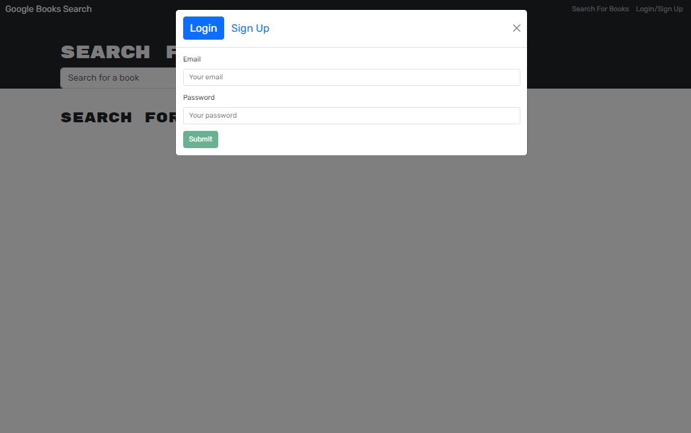

# Book Search Engine

## Description:
This application was created in the USYD Coding Bootcamp and refactors a Google Books API search engine from a RESTful API to a GraphQL API with Apollo Server. The search engine is built using the MERN stack - MongoDB, Express.js, React, and Node.js. A user can create an account, search for books, and save them to a list. On a separately rendered page, the user can see their saved books and remove books from the list.

## Installation

- Download it through Github
- Run npm i in terminal to install packages

## Live URL

The web application is deployed to Render. Link to deployed website: [Book Search Engine](https://book-search-engine-gkd2.onrender.com/)

## Screenshots

 Search For a Book

Saved Books
 

LogIn/Signup

## Technologies Used

This application is powered by JavaScript. It uses React.js (v18.2.0), Node.js (v18.16.0), Express.js(v4.17.2), GraphQL(v16.8.1), and ApolloServer(3.11.1). CSS and Bootstrap (v5.2.3) were utilized to create the overall styling of the user interface.

## Credits

- USYD-Bootcamp (week 21 class activities)
 
